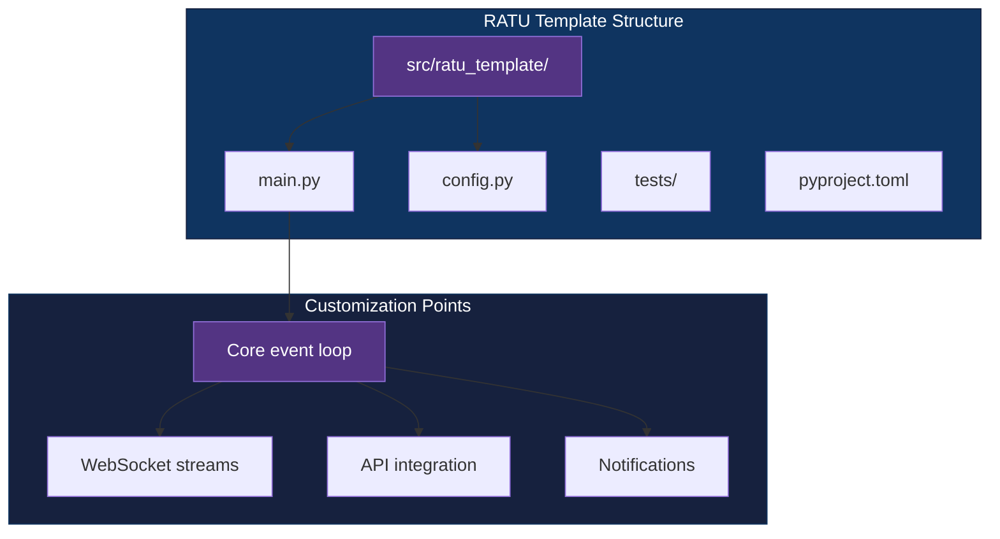

<div align="center">

# RATU Template

[](https://www.python.org/downloads/)
[](https://github.com/astral-sh/uv)
[](LICENSE)

**Opinionated Python scaffold for real-time, event-driven trading and monitoring systems: uv, pytest, async-first.**

[Getting Started](#getting-started) | [Usage](#usage) | [Architecture](#architecture)

</div>

---

## Table of Contents

- [Features](#features)
- [Tech Stack](#tech-stack)
- [Architecture](#architecture)
- [Getting Started](#getting-started)
  - [Prerequisites](#prerequisites)
  - [Installation](#installation)
  - [Configuration](#configuration)
- [Usage](#usage)
- [How It Works](#how-it-works)
- [Project Structure](#project-structure)
- [Testing](#testing)
- [Architectural Decisions](#architectural-decisions)
- [Related Projects](#related-projects)
- [License](#license)
- [Author](#author)

## Features

- **Opinionated `src/` layout** - prevents accidental imports, cleaner packaging, mirror test structure
- **uv-ready** - `pyproject.toml` with lockfile for fast, reproducible installs
- **Async-first test harness** - `pytest` + `pytest-asyncio` configured with `asyncio_mode="auto"`
- **Pragmatic linting** - `ruff` tuned for trading-bot patterns (destructured but unused API fields are OK)
- **Zero runtime dependencies** - batteries-excluded foundation; add only what the project needs

## Tech Stack

| Component | Technology |
|-----------|------------|
| Language | Python 3.10+ |
| Package manager | uv |
| Testing | pytest, pytest-asyncio |
| Linting | ruff |
| Runtime deps | none (add per project) |

## Architecture



## Getting Started

### Prerequisites

- Python 3.10+
- [uv](https://github.com/astral-sh/uv)

### Installation

```bash
git clone https://github.com/adityonugrohoid/ratu-template.git
cd ratu-template
uv sync
```

### Configuration

```bash
cp .env.example .env
```

Edit `.env` with your runtime settings (API keys, log levels, etc.).

## Usage

```bash
# Run the stub entry point
uv run ratu-template

# Run the test suite
uv run pytest
```

## How It Works

### What's pre-wired

| Element | Included |
|---------|----------|
| Project layout | `src/ratu_template/` with `__init__.py`, `main.py`, `config.py` |
| Test harness | `tests/` with pytest + asyncio config and a shared fixture |
| Packaging | `pyproject.toml` with a `[project.scripts]` CLI entry `ratu-template` |
| Linting | `ruff` with trading-domain-aware ignores (F401, F841) |
| Config skeleton | Module-level constants (`APP_NAME`, `VERSION`, `LOG_LEVEL`) |

### What a new project adds

- Core event loop / async orchestration in `main()`
- API clients, WebSocket handlers, or polling logic
- Environment loading (`.env.example` is provided; no `dotenv` library pre-wired)
- Real test coverage for any added modules

## Project Structure

```
ratu-template/
├── src/
│   └── ratu_template/
│       ├── __init__.py       # Package metadata (__version__)
│       ├── main.py           # Stub entry point -- replace with your logic
│       └── config.py         # Module constants + commented examples
├── tests/
│   ├── conftest.py           # Shared pytest fixtures
│   ├── test_main.py          # Verifies main() output
│   └── test_config.py        # Verifies config constants
├── .env.example              # Environment variable template
├── pyproject.toml            # Project + tool config, uv-lockable
├── uv.lock                   # Pinned dependency set
└── LICENSE
```

## Testing

```bash
uv run pytest                  # full test suite
uv run pytest -v               # verbose
uv run pytest -k test_main     # filter by name
```

## Architectural Decisions

### 1. `src/` layout

**Decision:** Packages are placed under `src/` with mirrored test structure.

**Reasoning:** Prevents accidental imports from the local directory, ensures wheel metadata is correct, and makes it obvious which modules are exportable. Test discovery stays aligned.

### 2. uv for package management

**Decision:** Use `uv` with a pinned lockfile instead of pip.

**Reasoning:** Fast, reproducible installs; single lockfile simplifies CI/CD and local dev parity. `pyproject.toml` is the source of truth.

### 3. Relaxed ruff rules

**Decision:** Ignore F401 (unused imports) and F841 (unused variables).

**Reasoning:** Pragmatic for trading bots where API responses are destructured and some fields are discarded; re-exports in `__init__.py` are common. Catches real syntax errors (E4, E7, E9) while avoiding noise.

### 4. Zero runtime dependencies

**Decision:** No pre-installed runtime packages; each project adds only what it needs.

**Reasoning:** Trading systems and monitoring tools have wildly different requirements (websockets, HTTP clients, data processing). Batteries-excluded foundation keeps onboarding lightweight.

### 5. Async-first test harness

**Decision:** pytest + pytest-asyncio with `asyncio_mode="auto"`.

**Reasoning:** Real-time event-driven systems need async support from day one. Auto mode handles fixture scoping transparently.

## License

This project is licensed under the [MIT License](LICENSE).

## Author

**Adityo Nugroho** ([@adityonugrohoid](https://github.com/adityonugrohoid))
