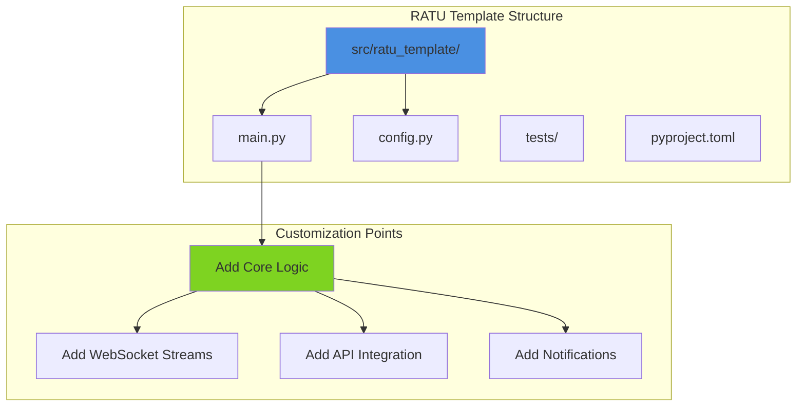

# RATU Template

[Python 3.10+](https://www.python.org/downloads/) | [uv](https://github.com/astral-sh/uv) | [RATUProject](https://github.com/adityonugrohoid)

Starter template for building real-time, event-driven trading and monitoring systems.

> **System Prototyping Focus**: Standardized project structure for rapid prototyping of event-driven systems

## Part of RATUProject

This repository is part of **RATUProject** (Real-time Automated Trading Unified) - an open-source portfolio demonstrating real-time, event-driven system design for financial markets and blockchain integrations.

## System Overview



## Project Structure

```
ratu-template/
  src/
    ratu_template/
      __init__.py      # Package initialization
      main.py          # Entry point
      config.py        # Configuration settings
  tests/
    conftest.py        # Shared fixtures
    test_main.py       # Main module tests
    test_config.py     # Config module tests
  pyproject.toml       # Project configuration (uv-ready)
  .env.example         # Environment variables template
  README.md            # This file
  LICENSE              # MIT License
```

## Design Decisions

| Decision | Rationale |
|----------|-----------|
| src layout | Prevents accidental imports, cleaner packaging |
| uv for dependencies | Fast, reliable Python package management |
| Looser linting | Pragmatic for bot development patterns |
| Mirror test structure | Easy to locate tests for each module |

## Setup

```bash
# Clone and navigate
git clone https://github.com/adityonugrohoid/ratu-template.git
cd ratu-template

# Sync dependencies with uv
uv sync

# Run tests
uv run pytest

# Run the application
uv run ratu-template
```

## Creating a New Project

1. Use this template on GitHub or clone directly
2. Rename `src/ratu_template/` to your project name
3. Update `pyproject.toml` with your project details
4. Add your core logic to `main.py`
5. Extend configuration in `config.py`

## License

This project is licensed under the MIT License - see the [LICENSE](LICENSE) file for details.

## Author

**Adityo Nugroho**
- GitHub: https://github.com/adityonugrohoid
- LinkedIn: https://www.linkedin.com/in/adityonugrohoid/
