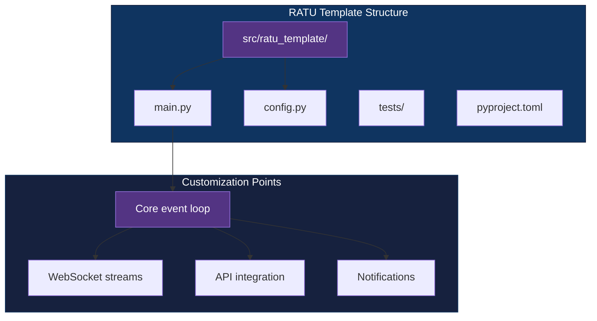

<div align="center">

# RATU Template

[](https://www.python.org/downloads/)
[](https://github.com/astral-sh/uv)
[](LICENSE)
[](#)

**Python template for rapid prototyping of real-time, event-driven trading and monitoring systems.**

[Getting Started](#getting-started) | [Architecture](#architecture) | [Creating a New Project](#creating-a-new-project-from-this-template)

</div>

---

## Features

- **Opinionated `src/` layout** — prevents accidental imports, cleaner packaging, mirror test structure
- **uv-ready** — `pyproject.toml` with lockfile for fast, reproducible installs
- **Async-first test harness** — `pytest` + `pytest-asyncio` configured with `asyncio_mode="auto"`
- **Pragmatic linting** — `ruff` tuned for trading-bot patterns (destructured but unused API fields are OK)
- **Zero runtime dependencies** — batteries-excluded foundation; add only what the project needs

## Tech Stack

| Component | Technology |
|-----------|------------|
| Language | Python 3.10+ |
| Package manager | uv |
| Testing | pytest, pytest-asyncio |
| Linting | ruff |
| Runtime deps | none (add per project) |

## Architecture



## Getting Started

### Prerequisites

- Python 3.10+
- [uv](https://github.com/astral-sh/uv)

### Installation

```bash
git clone https://github.com/adityonugrohoid/ratu-template.git
cd ratu-template
uv sync
```

### Usage

```bash
# Run the stub entry point
uv run ratu-template

# Run the test suite
uv run pytest
```

## How It Works

### What's pre-wired

| Element | Included |
|---------|----------|
| Project layout | `src/ratu_template/` with `__init__.py`, `main.py`, `config.py` |
| Test harness | `tests/` with pytest + asyncio config and a shared fixture |
| Packaging | `pyproject.toml` with a `[project.scripts]` CLI entry `ratu-template` |
| Linting | `ruff` with trading-domain-aware ignores (F401, F841) |
| Config skeleton | Module-level constants (`APP_NAME`, `VERSION`, `LOG_LEVEL`) |

### What a new project adds

- Core event loop / async orchestration in `main()`
- API clients, WebSocket handlers, or polling logic
- Environment loading (`.env.example` is provided; no `dotenv` library pre-wired)
- Real test coverage for any added modules

## Project Structure

```
ratu-template/
├── src/
│   └── ratu_template/
│       ├── __init__.py       # Package metadata (__version__)
│       ├── main.py           # Stub entry point — replace with your logic
│       └── config.py         # Module constants + commented examples
├── tests/
│   ├── conftest.py           # Shared pytest fixtures
│   ├── test_main.py          # Verifies main() output
│   └── test_config.py        # Verifies config constants
├── .env.example              # Environment variable template
├── pyproject.toml            # Project + tool config, uv-lockable
├── uv.lock                   # Pinned dependency set
└── LICENSE
```

## Testing

```bash
uv run pytest                  # full test suite
uv run pytest -v               # verbose
uv run pytest -k test_main     # filter by name
```

## Creating a New Project From This Template

1. Click **Use this template** on GitHub, or clone directly
2. Rename `src/ratu_template/` → `src/your_project/`
3. Update `pyproject.toml`: `name`, `[project.scripts]`, wheel target
4. Replace `main.py` with the project's event loop
5. Extend `config.py` for environment-specific settings
6. Add dependencies: `uv add <package>`

## Design Decisions

| Decision | Rationale |
|----------|-----------|
| `src/` layout | Prevents accidental imports, cleaner packaging |
| uv for dependencies | Fast, reproducible; lockfile included |
| Relaxed ruff rules | Pragmatic for bot patterns where API fields are destructured but unused |
| Mirror test structure | Easy to locate tests for each module |
| Zero runtime deps | Every project has different needs; don't prescribe |

## Part of RATUProject

**RATUProject** (Real-time Automated Trading Unified) is a personal portfolio of real-time, event-driven system designs for financial markets and blockchain integrations. This template is the scaffold for new RATU repositories.

## Roadmap

- [x] Base `src/` layout with uv
- [x] pytest + asyncio harness
- [x] CLI entry point
- [ ] Optional dotenv integration (commented example)
- [ ] Pre-commit hook recipe (ruff + pytest smoke)

## License

MIT — see [LICENSE](LICENSE).

## Author

**Adityo Nugroho** ([@adityonugrohoid](https://github.com/adityonugrohoid))
